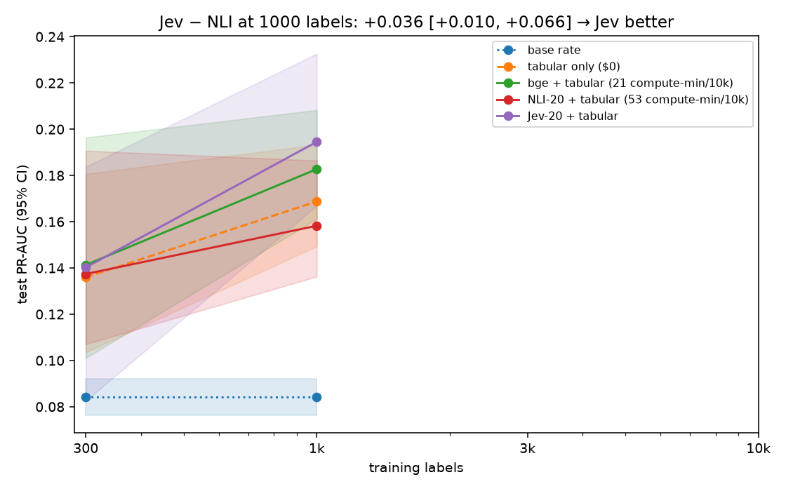
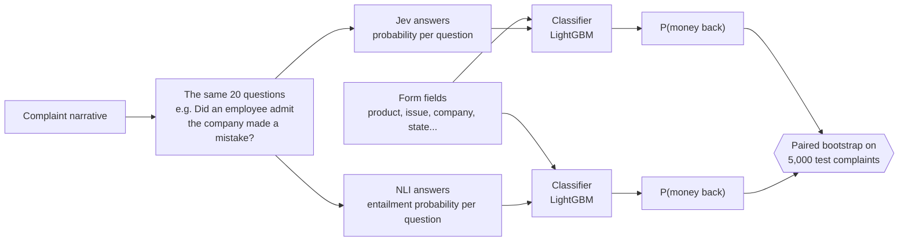
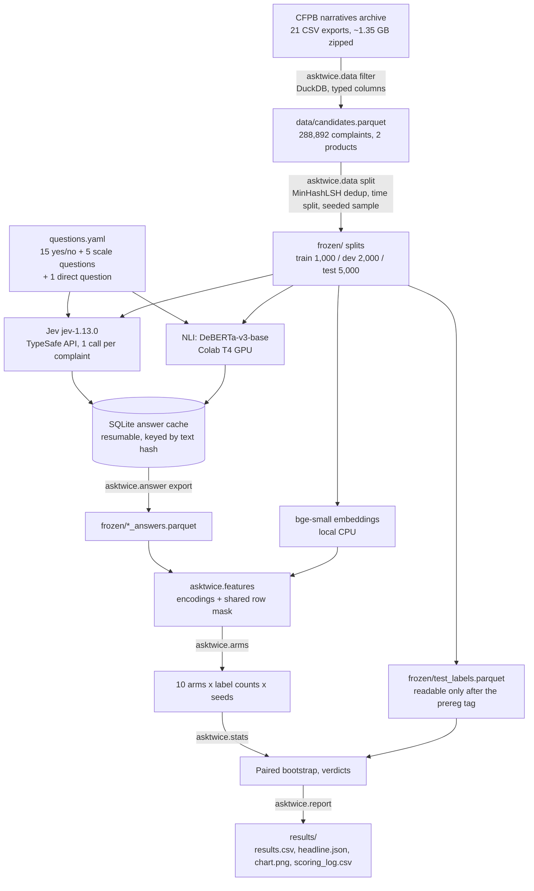
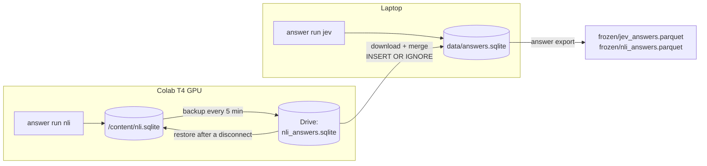
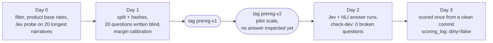
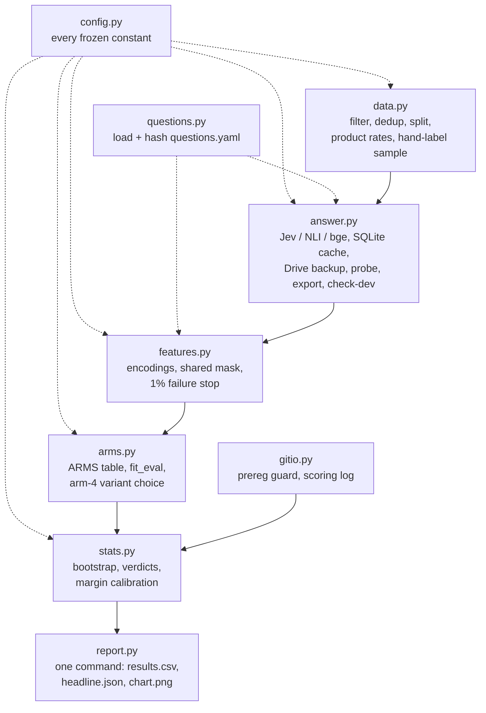

# Ask Twice

[](https://github.com/aarongunasingh/ask-twice/actions/workflows/ci.yml)

**Ask the same 20 plain-English questions about every consumer complaint twice.** First ask [TypeSafe](https://typesafe.ai)'s Jev, a model that returns typed answers with probabilities. Then ask a free open-source NLI model. Feed each set of answers into the same classifier, and predict which complaints ended with the consumer getting money back.

Holding the questions fixed and swapping only the answerer separates two things that usually get blurred: **is it the model, or is it the analyst who wrote good questions?**

The experiment was pre-registered. Every analysis choice was committed and tagged before any answer was looked at, and the test set was scored exactly once.

> This project is independent and **not affiliated with TypeSafe AI**.

---

## TL;DR



| | |
|---|---|
| **Headline (pre-registered)** | With the same 20 questions, Jev's answers made better features than the NLI model's: **+0.036 PR-AUC, 95% CI [+0.010, +0.066] → "Jev better"** (1,000 training labels, 5,000 test complaints). |
| **Per-question accuracy** | Jev agreed with the spot-check labels **80–95%** of the time on every sampled question; NLI ranged **20–90%**. |
| **But** | Plain **TF-IDF + logistic regression scored highest** (0.242 vs 0.195). Jev + form fields did not clearly beat embeddings + form fields or the form fields alone. |
| **So** | Jev is the better *question-answerer*. Asking questions was not the best way to *predict this outcome*. Jev's case is accurate, readable per-complaint judgments, not raw predictive lift. |

Scale caveat: this is a **pilot** (1,000 training rows, 5,000 test rows; see [Deviations](#deviations-from-the-plan)).

---

## Contents

1. [The idea](#the-idea)
2. [Pipeline](#pipeline)
3. [Pre-registration](#pre-registration)
4. [Data](#data)
5. [The questions](#the-questions)
6. [Answerers and features](#answerers-and-features)
7. [Models (arms)](#models-arms)
8. [Statistics](#statistics)
9. [Results](#results)
10. [What it means](#what-it-means)
11. [Deviations from the plan](#deviations-from-the-plan)
12. [Limitations](#limitations)
13. [Code architecture](#code-architecture)
14. [Reproduce it](#reproduce-it)
15. [Repository layout](#repository-layout)
16. [Terms and data handling](#terms-and-data-handling)
17. [References](#references)

---

## The idea



Earlier Jev evaluations compared it with TF-IDF, BERT and zero-shot baselines. TypeSafe's own feature-discovery cookbook already feeds Jev answers into gradient boosting, the method known as QA-Emb (Benara et al., 2024). What was missing is **attribution**. If question features beat embeddings, is that the answerer or the questions? Ask Twice holds the questions constant and swaps the answerer. It also runs every standard baseline (form fields, TF-IDF, embeddings) through the same sampling and fitting code.

---

## Pipeline



The NLI step is the expensive one: 35 premise–hypothesis pairs per complaint (one per yes/no question, one per scale level). It runs on a free Colab GPU through [`colab_nli.ipynb`](colab_nli.ipynb), while Jev runs from any laptop. Both write to the same SQLite schema, so the two cache files merge cleanly:



The cache's primary key is `(answerer, model_version, question_set_hash, text_sha256)`. A re-run skips every narrative already answered. A different model version or a changed question set can never be mixed in by accident.

---

## Pre-registration



| Safeguard | How it works |
|---|---|
| **Frozen before answers** | Questions, NLI hypotheses, splits and hashes, feature encodings, model grids, statistical tests and the margin are committed under git tags [`prereg-v1`](https://github.com/aarongunasingh/ask-twice/tree/prereg-v1) and [`prereg-v2`](https://github.com/aarongunasingh/ask-twice/tree/prereg-v2). |
| **Blind questions** | Written from 150 random dev-set narratives, without looking at outcomes or any answerer output. |
| **Test-label guard** | `stats.load_test_labels()` refuses to run unless `HEAD` descends from the prereg tag. Test labels live in their own file. |
| **Broken-question check** | `answer check-dev` flags any question whose dev answers barely vary (std < 0.01) for either answerer, and shows no outcome information. It flagged none. |
| **One scoring run** | Every scoring run appends its commit, a dirty-tree flag and a diff hash to [`results/scoring_log.csv`](results/scoring_log.csv). The published run is the only row: commit `b822279`, `dirty=false`. |
| **Amendments logged** | Every change after `prereg-v1` is in [`CHANGELOG.md`](CHANGELOG.md), with the reason. |

The full design, with its rationale, is in [`PLAN.md`](PLAN.md).

---

## Data

| | |
|---|---|
| **Source** | [CFPB Consumer Complaint Database](https://www.consumerfinance.gov/foia-requests/foia-electronic-reading-room/cfpb-consumer-complaint-database-narratives-archive/) with consumer narratives. Publication of narratives ended on 2026-08-14, so the archive is frozen. |
| **Target** | `Company response to consumer == "Closed with monetary relief"` → 1, else 0 |
| **Kept** | Complaints with a narrative and a final response (monetary relief, non-monetary relief, or explanation), received up to 2026-06-15 |
| **Products** | *Checking or savings account* and *Money transfer, virtual currency, or money service*. Training-pool relief rates: 17.5% and 11.0%. |
| **Dropped** | Credit reporting (template-driven, almost never relief). Credit cards: the CFPB renamed "Credit card or prepaid card" to "Credit card" in 2023, so the training window and test window share no product value. Fields set at or after the company's response (timeliness, disputes, public response). |
| **Dedup** | `datasketch` MinHashLSH, Jaccard ≥ 0.8 on 5-word shingles. Test rows that nearly duplicate a train or dev row are removed. |

**Time split.** Train on the past, test on the future:

| Split | Received | Candidates | Sampled | Used for |
|---|---|---|---|---|
| Train | 2019–2022 | 70,770 | 1,000 | Label-count draws |
| Dev | 2023 | 36,449 | 2,000 | Writing questions, choosing model settings |
| Test | 2024-01 → 2026-06-15 | 181,673 | 5,000 | Scored once. Relief rate 8.4%. |

---

## The questions

All 20 are in [`questions.yaml`](questions.yaml). Claude (claude-opus-5) wrote them from 150 blind dev narratives, following the plan's rules:
- nothing a regex, counter or date comparison could answer;
- no negations or multi-step wording;
- nothing that restates the complaint's product or issue fields;
- a high value always means "yes".

**15 yes/no questions (Jev "Noul"):**

| id | Question sent to Jev |
|---|---|
| `employee_admitted_error` | Does the consumer say a company employee admitted that the company made a mistake? |
| `some_money_returned` | Does the consumer say the company has already given back some of the money in dispute? * |
| `credit_taken_back` | Does the consumer say the company gave them a temporary credit and later took it back? |
| `shared_access_code` | Does the consumer say they gave a one-time code, password, or PIN to another person? * |
| `reported_quickly` | Does the consumer say they reported the problem to the company as soon as they discovered it? |
| `has_evidence` | Does the consumer say they have documents, receipts, screenshots, or recordings that support their account of events? |
| `policy_cited` | Does the consumer say the company justified its decision by pointing to its policy, terms, or account agreement? |
| `conflicting_answers` | Does the consumer say different company employees gave them conflicting information? |
| `reason_withheld` | Does the consumer say the company refused to tell them the reason for its decision? |
| `wants_money_back` | Does the consumer ask to get money back from the company? * |
| `legal_action` | Does the consumer threaten or pursue legal action against the company? |
| `basic_needs_hardship` | Does the consumer say the problem left them unable to pay for basic needs such as rent, bills, or food? |
| `broken_promise` | Does the consumer say a company employee promised a fix or refund that the company then failed to deliver? |
| `companies_blame_each_other` | Does the consumer say two companies are each telling them that the other one is responsible? |
| `consumer_own_mistake` | Does the consumer admit that a mistake of their own contributed to the problem? * |

\* also sends explicit yes/no definitions (`criteria`), because the boundary is subtle.

**5 ordered-scale questions (Jev "Score", 4 levels each):**

| id | Question | Lowest level → highest level |
|---|---|---|
| `follow_up_effort` | How far has the consumer pursued the problem with the company before filing this complaint? | no contact described → escalated to managers or an executive office |
| `company_position` | What position does the consumer say the company has taken on their request? | formally denied → already paid back |
| `fault_shown` | How clearly does the consumer show that the company caused the problem? | doesn't say who caused it → company's own records or staff confirmed it |
| `consumer_role` | How much did the consumer's own actions lead to the loss? | no action by the consumer → sent money or access at a deceiver's request |
| `narrative_clarity` | How clearly does the complaint explain what happened? | fragment → clear sequence of events and a stated ask |

Plus one **direct question** used on its own (arm 7): *"Will this complaint end with monetary relief?"*

Each question has a matching NLI hypothesis, one per level for scale questions, written at the same time and frozen with it. Example: *"A company employee admitted that the company made a mistake."*

---

## Answerers and features

| | Jev | NLI (the free control) | Embeddings |
|---|---|---|---|
| **Model** | `jev-1.13.0`, pinned. Every response's `model` field is checked. | [`MoritzLaurer/DeBERTa-v3-base-mnli-fever-anli`](https://huggingface.co/MoritzLaurer/DeBERTa-v3-base-mnli-fever-anli) | [`BAAI/bge-small-en-v1.5`](https://huggingface.co/BAAI/bge-small-en-v1.5), 384 dims |
| **How it's called** | Official `typesafe-sdk`, one request per complaint carrying all 21 questions | `AutoModelForSequenceClassification`, fp16 on GPU, length-sorted batches | Mean-pooled 512-token chunks |
| **Long text** | Whole narrative (the 20 longest all passed a Day 0 probe, the largest at 9,165 tokens) | Chunks of 512 − hypothesis − 3 tokens, 64-token overlap | 512-token chunks |
| **Yes/no feature** | The `noul` probability | P(entailment) from the full 3-way softmax, max over chunks | n/a |
| **Scale feature** | Expected level Σ level × P(level) | Per level: max entailment logit over chunks → softmax across levels → expected level | n/a |

**Why not HuggingFace's zero-shot pipeline:** in `multi_label` mode it softmaxes entailment against contradiction only and drops "neutral". A narrative that never mentions a topic then scores around 0.5 instead of near 0.

**Form fields ("tabular"):** product, sub-product, issue, sub-issue, company (top 50 in the training pool, else "other"), state, submission channel, tags, and month of year. Year is excluded, because under a time split every test year falls outside the training range.

**Shared row mask:** a complaint is used only if Jev, NLI and bge all answered it. In this run all three answered all 8,000.

---

## Models (arms)

Every arm runs through one `fit_eval(arm, n_labels, seed)`, so they share sampling, stratification and fitting code.

| # | Arm | Features | Classifier | Why it's here |
|---|---|---|---|---|
| 0 | Base rate | none | none | The floor |
| 1 | **Tabular only** | form fields | LightGBM | The bar every text arm must clear |
| 2 | TF-IDF | narrative words and bigrams | Logistic regression | Classic text baseline |
| 3 | bge | embeddings | Logistic regression | Embeddings with the head they suit |
| 4 | **bge + tabular** | embeddings (stacked score) + form fields | LightGBM | Strongest non-question arm |
| 5 | NLI-20 | 20 NLI answers | Logistic regression | Answer quality without form fields |
| 6 | Jev-20 | 20 Jev answers | Logistic regression | Answer quality without form fields |
| 7 | Jev direct | 1 Jev answer used as the score | none | Does splitting into questions matter? |
| 8 | **NLI-20 + tabular** | 20 NLI answers + form fields | LightGBM | The control that makes attribution possible |
| 9 | **Jev-20 + tabular** | 20 Jev answers + form fields | LightGBM | The arm under test |

**Bold** arms are on the chart. Settings:
- **Label counts:** 300 (10 random stratified draws) and 1,000 (the whole training pool, so one fit).
- **LightGBM:** fixed small settings below 1,000 labels. At 1,000 it's tuned on dev from a grid committed at the tag.
- **Logistic regression:** `C` tuned on dev at 1,000 labels.
- **Arm 4 variant:** raw vs stacked was chosen once on dev. Stacked won, with a dev PR-AUC of 0.245 vs 0.237.

---

## Statistics

- **Primary metric:** test **PR-AUC** (area under the precision–recall curve). With only 8.4% positives, it rewards ranking the relief cases near the top, which is what triage needs. ROC-AUC is reported as a secondary metric.
- **Confidence intervals:** 1,000 bootstrap resamples, drawing test rows and seeds together. One resample-index matrix is shared by every arm, so every comparison is **paired**.
- **Headline test:** Δ = PR-AUC(Jev-20 + tab) − PR-AUC(NLI-20 + tab) at 1,000 labels.

| Verdict | Rule |
|---|---|
| Jev better | CI lower bound > 0 |
| NLI better | CI upper bound < 0 |
| Equivalent | whole CI inside ±0.02 |
| Inconclusive | none of the above |

Equivalence is never claimed from a non-significant difference.

**Secondary checks:**
- **Single-window delta:** the headline test on complaints short enough to fit in one NLI window, so both answerers see the whole text.
- **Stops beating:** the first label count where Jev-20 + tab fails to beat bge + tab.
- **Contamination:** Jev (2026) may have seen CFPB complaints in pretraining, so arm 7's score is reported per half-year and the headline is repeated on 2026 complaints only, descriptively.

---

## Results

All numbers come from [`results/results.csv`](results/results.csv) and [`results/headline.json`](results/headline.json), 5,000 test complaints.

### Headline and robustness

| Comparison | Rows | Δ PR-AUC | 95% CI | Verdict |
|---|---|---|---|---|
| **Jev-20 + tab − NLI-20 + tab, 1,000 labels** | 5,000 | **+0.036** | **[+0.010, +0.066]** | **Jev better** |
| Same, complaints that fit one NLI window | 4,601 | +0.033 | [+0.004, +0.066] | Jev better |
| Same, 2026 complaints only (descriptive) | 723 | +0.050 | [−0.042, +0.138] | inconclusive |
| Jev-20 + tab − bge + tab, 300 labels | 5,000 | −0.001 | [−0.056, +0.063] | not better |
| Jev-20 + tab − bge + tab, 1,000 labels | 5,000 | +0.012 | [−0.014, +0.046] | not better → "never beats" |

Jev's edge holds when both answerers see the full text (the single-window row), so it isn't just an artifact of the NLI model's 512-token window.

### Every arm

PR-AUC with 95% CI. Random guessing scores 0.084.

| # | Arm | 300 labels | 1,000 labels | ROC-AUC (1k) | Lift over tabular (1k) |
|---|---|---|---|---|---|
| 0 | Base rate | 0.084 | 0.084 | 0.500 | — |
| 1 | Tabular only | 0.136 [0.104, 0.181] | 0.169 [0.149, 0.193] | 0.738 | — |
| 2 | **TF-IDF** | **0.202** [0.167, 0.245] | **0.242** [0.206, 0.282] | **0.767** | **+0.073** [+0.041, +0.109] |
| 3 | bge | 0.164 [0.118, 0.216] | 0.232 [0.197, 0.271] | 0.714 | +0.063 [+0.033, +0.097] |
| 4 | bge + tabular | 0.141 [0.101, 0.196] | 0.183 [0.161, 0.208] | 0.743 | +0.014 [−0.001, +0.029] |
| 5 | NLI-20 | 0.140 [0.110, 0.178] | 0.162 [0.139, 0.191] | 0.670 | −0.006 [−0.030, +0.023] |
| 6 | Jev-20 | 0.161 [0.131, 0.197] | 0.182 [0.157, 0.214] | 0.697 | +0.013 [−0.014, +0.044] |
| 7 | Jev direct (no training) | 0.148 [0.131, 0.173] | 0.148 [0.131, 0.173] | 0.684 | −0.021 [−0.044, +0.003] |
| 8 | NLI-20 + tabular | 0.137 [0.107, 0.191] | 0.158 [0.136, 0.186] | 0.669 | −0.011 [−0.033, +0.015] |
| 9 | **Jev-20 + tabular** | 0.140 [0.083, 0.184] | **0.195** [0.167, 0.233] | 0.710 | +0.026 [−0.001, +0.060] |

Comparisons between arms other than the headline (for example TF-IDF vs Jev) are **descriptive**. They weren't pre-registered as tests, and separate CIs overlapping or not isn't a paired test.

### Answer quality spot check

These are 20 test complaints × 5 randomly drawn yes/no questions = 100 judgments. **A Claude subagent made the labels, not a person** (see [Deviations](#deviations-from-the-plan)). It saw only the narratives and questions, never any model's answers. Answers are thresholded at 0.5.

| Question | "Yes" labels (of 20) | Jev agreement | NLI agreement |
|---|---|---|---|
| `companies_blame_each_other` | 0 | 95% | **20%** |
| `conflicting_answers` | 1 | 95% | 55% |
| `employee_admitted_error` | 2 | 95% | 90% |
| `reason_withheld` | 1 | 95% | 85% |
| `wants_money_back` | 11 | 80% | 60% |

Jev's expected calibration error on these 100 judgments is 0.115. Most sampled questions have almost no "yes" cases, so these numbers mainly measure false alarms. On `companies_blame_each_other`, NLI said "yes" for 16 of 20 complaints that never said it; Jev did so for 1.

### Contamination slice (descriptive)

Arm 7 (Jev's direct question, no training) by half-year:

| Half-year | Rows | PR-AUC [95% CI] |
|---|---|---|
| 2024 H1 | 489 | 0.209 [0.155, 0.294] |
| 2024 H2 | 583 | 0.213 [0.165, 0.283] |
| 2025 H1 | 2,305 | 0.091 [0.064, 0.138] |
| 2025 H2 | 900 | 0.152 [0.116, 0.209] |
| 2026 H1 | 723 | 0.168 [0.131, 0.224] |

There's no steady fall-off toward 2026, which a pure memorization effect would predict. But relief rates also shift between periods, so this is weak evidence either way. TypeSafe hasn't published Jev's training cutoff.

### Compute

| | Per 10,000 complaints |
|---|---|
| NLI answers (35 hypotheses per complaint) | ~53 GPU-minutes on a Colab T4 |
| bge embeddings | ~21 CPU-minutes |
| TF-IDF, tabular | seconds |
| Jev | 1,671 input tokens per complaint on average. Dollar figures are kept private; see [Terms](#terms-and-data-handling). |

Failures: 0 for Jev, NLI and bge on all 8,000 rows.

---

## What it means

**What the data supports:**
1. **Jev answers questions better than a strong free NLI model.** The pre-registered headline favors Jev, the single-window check agrees, and the per-question spot check shows NLI raising many more false alarms.
2. **Question features weren't the best predictor here.** A bag-of-words model (TF-IDF) ranked relief cases best at both label counts. Jev + form fields didn't clearly beat embeddings + form fields or the form fields alone.
3. **With zero labels, Jev still gives a usable ranking.** The direct question alone scored 0.148, about 1.8× random. That's in line with a form-field model trained on 300 labeled complaints (0.136).

**Where that points (my extrapolation, not tested here):** Jev fits jobs where the per-item judgment is itself the product:
- **Triage with reasons:** route "employee admitted a mistake" + "wants money back" to remediation, with a flag a reviewer can read.
- **Monitoring:** trend flags such as "company refused to explain its decision" by bank and month.
- **Turning free text into columns** for analytics, where a false "yes" rate like NLI's on `companies_blame_each_other` would wreck the numbers.
- **Cold start:** rank a new queue before any outcome labels exist.

If all you need is the best prediction and you have a few hundred labels, start with TF-IDF or embeddings.

---

## Deviations from the plan

Every change after `prereg-v1` is logged in [`CHANGELOG.md`](CHANGELOG.md). All were made before any answer was inspected.

| Change | Why | Consequence |
|---|---|---|
| **Test set grown to 16,500** (in `prereg-v1`) | Margin calibration: CI half-width 0.023 on a 7,404-row 2022 pseudo-test, above the 0.015 limit. A subsample fit (h² = 3.564/n + 9e-6) put the needed size at ~16.5k. | None; superseded below. |
| **Pilot scale** (`prereg-v2`): train 20,500 → 1,000, test 16,500 → 5,000, label counts {300, 1k, 3k, 10k} → {300, 1k} | The NLI run on a free Colab GPU would have taken ~4 hours; the owner wanted a quick "is Jev good?" answer. | The 1,000-label point is one fit on the whole pool, so its CI covers test-row noise only, not seed noise. At 5,000 test rows, "equivalent" is out of reach (half-width ~0.025 > margin). The "stops beating" curve covers 300 and 1,000 only. |
| **Spot check: 20 × 5 instead of 100 × 5, labeled by Claude** | The owner didn't have time to label 500 judgments by hand. | The accuracy numbers measure agreement with a careful Claude reader, not with a human. They're small-sample and rough. |
| **Questions written by Claude**, not the owner | Owner's choice. Still blind to outcomes and answers. | The questions reflect one writer's judgment. A different writer might do better or worse. |

---

## Limitations

- **One dataset, two products, one question set.** Nothing here says how Jev does on other text or other questions.
- **Heads matter.** On embeddings, logistic regression alone (0.232) beat LightGBM with form fields (0.183). So the "+ tabular" arms aren't the best way to use text. The Jev-vs-NLI comparison stays fair because both use the same head.
- **Base-rate shift.** Relief is 11–17.5% in the training years but 8.4% in the test years. Every arm faces this equally.
- **Contamination can't be ruled out.** See the descriptive slice above.
- **Raw Jev answers aren't published** (see below), so reproducing the numbers needs your own TypeSafe key.

---

## Code architecture



| Codepath | Realistic failure | Handling |
|---|---|---|
| Jev run | `jev-latest` changes mid-run | Version pinned and asserted; the run aborts |
| Jev run | 422 (request failed validation) | Recorded, not retried; > 10 at > 1% stops the run |
| Jev run | Network timeout | Run stops; re-running resumes from the cache |
| NLI on Colab | Runtime disconnect | Local SQLite + Drive backup; Run all resumes |
| NLI scoring | Label order differs by model | Entailment index read from `label2id` |
| Features | An answerer fails on > 1% of test rows | Run stops |
| Data | A CFPB column is renamed | Typed DuckDB read fails loudly |
| Stats | Test scored before the tag | Guard refuses |

**Tests:** `pytest` covers the filter rules, split integrity, cache keys and resume, NLI chunking, encodings, the shared mask, stratified draws, bootstrap verdicts, the prereg guard, and an end-to-end run on a synthetic fixture with no network. CI runs on every push.

---

## Reproduce it

### Setup

Needs Python 3.11 or newer.

```bash
python -m venv .venv
source .venv/bin/activate            # Windows: .venv\Scripts\activate
pip install -e ".[jev,nli]" pytest
python -m pytest                     # no API key or model download needed
```

Commands below assume the virtual environment is active. Jev needs a key from [console.typesafe.ai](https://console.typesafe.ai/), in `TYPESAFE_API_KEY`.

### Run

**1. Download the data** (21 zips, ~1.35 GB). The CFPB site blocks some HTTP clients; `curl` works:

```bash
mkdir -p data/ccdb
curl -sL "https://www.consumerfinance.gov/foia-requests/foia-electronic-reading-room/cfpb-consumer-complaint-database-narratives-archive/" \
  | grep -o 'https://files.consumerfinance.gov/f/documents/CCDB_Export_[^"]*\.zip' | sort -u \
  | xargs -n1 curl -L --output-dir data/ccdb -O
for f in data/ccdb/*.zip; do unzip -o -q -d data/ccdb "$f"; done
```

**2. Filter and split.** The committed `frozen/` splits already match `prereg-v2`. Re-running `split` with the same seed should reproduce them; compare against the hashes in `frozen/splits.json`.

```bash
python -m asktwice.data filter --csv "data/ccdb/*.csv"
python -m asktwice.data rates
python -m asktwice.data split
```

**3. Answer.** Jev runs locally. NLI runs on a GPU: open [`colab_nli.ipynb`](colab_nli.ipynb) in Colab [](https://colab.research.google.com/github/aarongunasingh/ask-twice/blob/main/colab_nli.ipynb), pick a T4 GPU and choose Run all, then download `nli_answers.sqlite` into `data/`.

```bash
python -m asktwice.answer run jev
python -c "import sqlite3; c = sqlite3.connect('data/answers.sqlite'); c.execute(\"ATTACH 'data/nli_answers.sqlite' AS n\"); c.execute('INSERT OR IGNORE INTO answers SELECT * FROM n.answers'); c.commit()"
python -m asktwice.answer export
python -m asktwice.answer check-dev
```

**4. Score.** The command refuses to run before the prereg tag, appends a row to `results/scoring_log.csv`, and regenerates every number:

```bash
python -m asktwice.report
```

---

## Repository layout

```
asktwice/
  config.py       every frozen constant (products, sizes, margins, grids, seeds)
  questions.py    load, validate and hash questions.yaml
  data.py         DuckDB filter, MinHashLSH dedup, time split, hashes, hand-label sample
  answer.py       Jev / NLI / bge, SQLite cache + Drive backup, run / export / probe / check-dev
  features.py     encodings, shared row mask, 1% failure stop
  arms.py         ARMS table, fit_eval, arm-4 variant choice
  stats.py        bootstrap, verdicts, margin calibration, test-label guard
  gitio.py        prereg guard and scoring-log helpers
  report.py       one command: results.csv, headline.json, chart.png
questions.yaml    the 20 frozen questions + NLI hypotheses + the direct question
frozen/           splits, split hashes, test labels, NLI answers, spot-check labels
results/          results.csv, headline.json, chart.png, scoring_log.csv
colab_nli.ipynb   the NLI run on a Colab GPU
tests/            pytest suite, synthetic fixture, no network
PLAN.md           the full pre-registered design
CHANGELOG.md      every amendment after prereg-v1, with reasons
```

---

## Terms and data handling

- TypeSafe's [Master Customer Agreement](https://typesafe.ai/legal/mca) assigns Output to the customer, but bars using Output to train a model that imitates Jev (§2.3(b)). **Raw Jev answers (`frozen/jev_answers.parquet`) are therefore not published**, so nobody can use them for that. Only derived results are.
- The same agreement treats fees and pricing as confidential (§14.1). **Jev dollar figures from this run are kept in a local, gitignored file.** The repo reports compute time and token counts instead.
- CFPB complaint data is public. Narratives were already redacted by the CFPB (`XXXX`).
- This is not legal advice.

---

## References

- TypeSafe AI, [Introducing System One Models & Jev](https://typesafe.ai/blog/introducing-system-one-models-and-jev) · [API docs](https://docs.typesafe.ai/api.md) · [jev-1.13 jaggedness](https://docs.typesafe.ai/model-jaggedness/jev-1.13.md) · [feature-discovery cookbook](https://docs.typesafe.ai/cookbooks/autoresearch_feature_discovery)
- Benara et al., *Crafting Interpretable Embeddings by Asking LLMs Questions* (QA-Emb), 2024: [arXiv:2405.16714](https://arxiv.org/abs/2405.16714)
- Independent Jev evaluations: [priorbench/jev](https://github.com/priorbench/jev) · [zhuyansen/jev-zeroshot-vs-bert](https://github.com/zhuyansen/jev-zeroshot-vs-bert) · [AbdelStark/jev-benchmarks](https://github.com/AbdelStark/jev-benchmarks) · [fstandhartinger/jevbench](https://github.com/fstandhartinger/jevbench)
- CFPB, [narratives archive](https://www.consumerfinance.gov/foia-requests/foia-electronic-reading-room/cfpb-consumer-complaint-database-narratives-archive/) · [end of narrative publication](https://www.consumerfinance.gov/about-us/newsroom/the-cfpb-to-cease-discretionary-publication-of-complaint-narratives-and-visualizations/) (2026-08-14)
